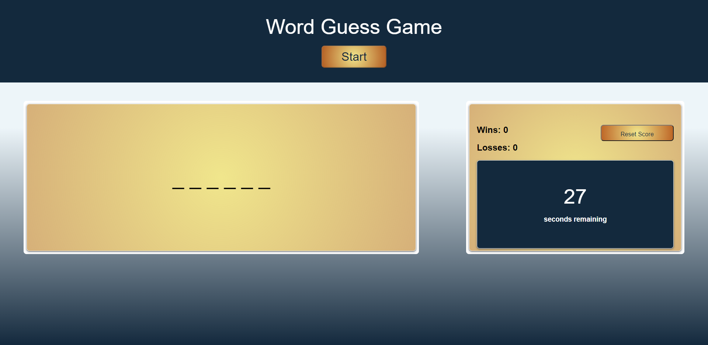
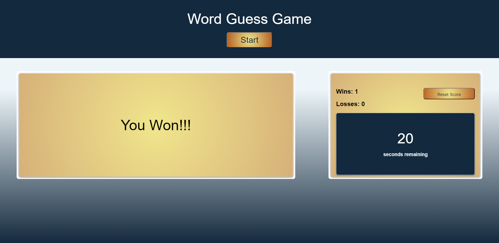

# Word Guess Game

## 📖Table of Contents
1. [Description](#description)
2. [Link](#Link)
3. [Screenshots](#Screenshots)
4. [Technologies](#Technologies)
5. [Contributing](#Contributing)
6. [Author](#Author)
7. [License](#License)

## Description

A timed word guess game that requires the user to guess the word by pressing individual keys to reveal what letters fit in the word. 

Win and lose scores are saved at the end of the game and displayed on the web page.

## Link

The link to the deployed application:

Code Quiz: https://trushilbudhia.github.io/Word-Guess-Game/

## Screenshots

The following images show the web application's appearance:

## Technologies
- JavaScript
- HTML
- CSS

## Contributing
Contributions, issues and feature requests are welcome.

Feel free to check [issues page](https://github.com/TrushilBudhia/Word-Guess-Game/issues) if you want to contribute.

## Author
👤Trushil Budhia
- Github: [@Trushil](https://github.com/TrushilBudhia)
- Email: trushil.budhia@gmail.com

## License
Copyright © 2021 [Trushil](https://github.com/TrushilBudhia)

This project is [MIT](./LICENSE) licensed
